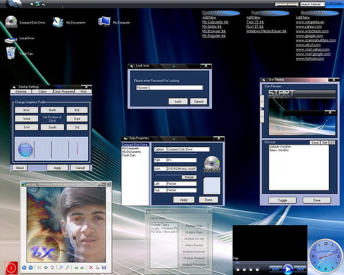



## Expert 8\-X Dextop \(Crash Fixed\)

### Description

The best shell replacement you can find on psc. Bundles of features are included. Complex source code, a great example for every one. Many usercontrols.The best and most useful are media player, label text, file list etc. These are made by me for this. Best features are USEI, Link Lock, Window hide, Window transparent, full featured Media Player with load/save playlist and File managment system, 32-Bit icons load, cool login screen, screen lock by password, fading and transparent shut down screen, picture tag of window (In operation) and also easy to use. NOTE : DO NOT CLOSE DEXTOP BY TASK MANAGER,PLEASE VOTE.

username = 'user'

password = 'pass'
 
### More Info
 

             |
---                |---
**Submitted On**   |2008-06-11 14:51:44
**By**             |[Xelon Labs](https://github.com/Planet-Source-Code/PSCIndex/blob/master/ByAuthor/xelon-labs.md)
**Level**          |Advanced
**User Rating**    |4.4 (40 globes from 9 users)
**Compatibility**  |VB 4\.0 \(32\-bit\), VB 5\.0, VB 6\.0
**Category**       |[Complete Applications](https://github.com/Planet-Source-Code/PSCIndex/blob/master/ByCategory/complete-applications__1-27.md)
**World**          |[Visual Basic](https://github.com/Planet-Source-Code/PSCIndex/blob/master/ByWorld/visual-basic.md)
**Archive File**   |[Expert\_8\-X2116296122008\.zip](https://github.com/Planet-Source-Code/xelon-labs-expert-8-x-dextop-crash-fixed__1-70650/archive/master.zip)

